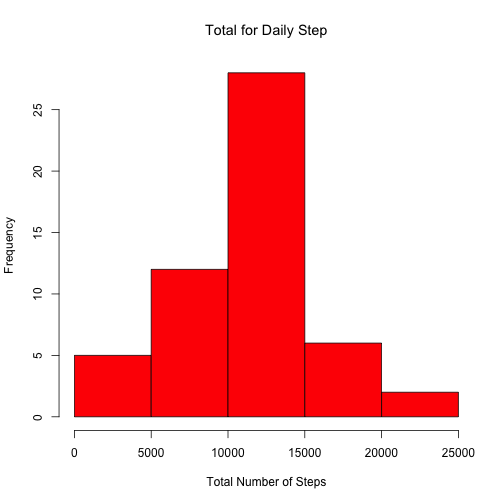
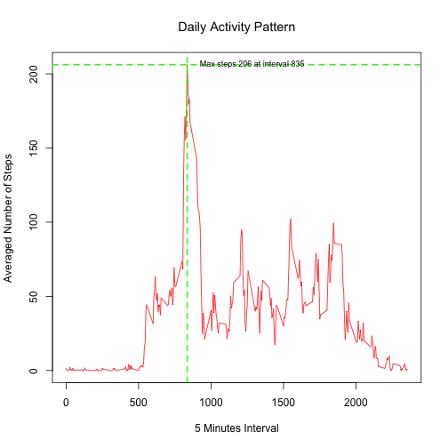
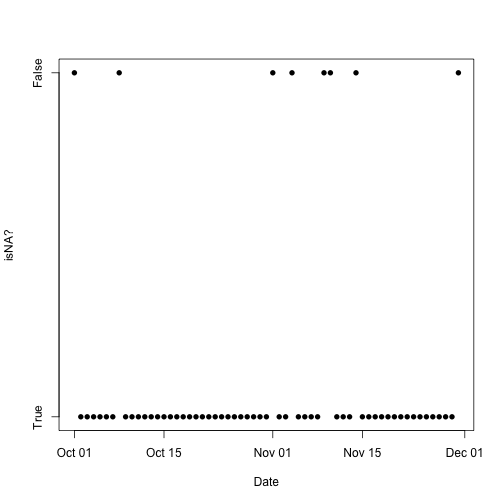
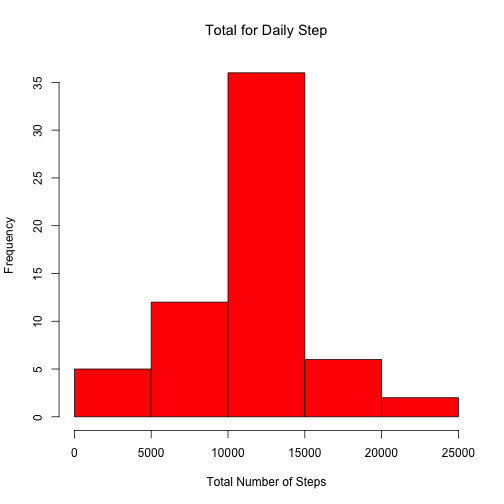
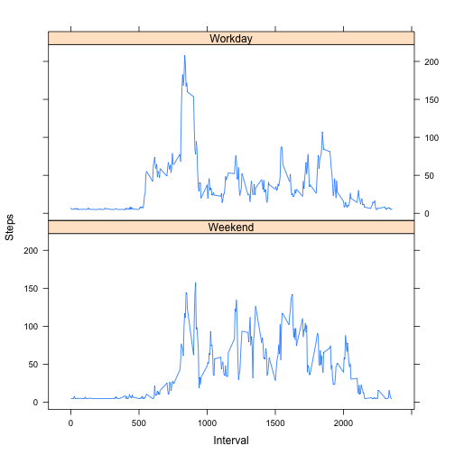

## Loading and preprocessing the data

```r
# Loading libraties (supressing loading output messages)
suppressMessages(library(plyr))
suppressMessages(library(dplyr))
suppressMessages(library(lattice))
suppressMessages(library(knitr))

# Compressed file Name
zfName <- "activity.zip"

# Data File Name
fName <- "activity.csv"

# Open a connection to the Compressed File / Data File
zFile <- unz(zfName, fName)

# Read Data File
fData <- read.csv(zFile)
  
# Converting date column to date Date Type  
fData <- mutate(fData, date=as.Date(date)) %>% arrange(date, steps)

# Order by date
fData <- arrange(fData, date, interval)

# Close connection
# close(zFile)
```


```r
# Dump existing data
summary(fData)
```

```
##      steps             date               interval     
##  Min.   :  0.00   Min.   :2012-10-01   Min.   :   0.0  
##  1st Qu.:  0.00   1st Qu.:2012-10-16   1st Qu.: 588.8  
##  Median :  0.00   Median :2012-10-31   Median :1177.5  
##  Mean   : 37.38   Mean   :2012-10-31   Mean   :1177.5  
##  3rd Qu.: 12.00   3rd Qu.:2012-11-15   3rd Qu.:1766.2  
##  Max.   :806.00   Max.   :2012-11-30   Max.   :2355.0  
##  NA's   :2304
```


## What is mean total number of steps taken per day?

```r
fData %>% 
  filter(!is.na(steps)) %>%
  group_by(date) %>% 
  summarise(
    Mean=mean(steps), 
    Median=median(steps), 
    Total = sum(steps)
  ) -> totalStepsByDate

hist(totalStepsByDate$Total, main = "Total for Daily Step", col=rgb(1,0,0), xlab="Total Number of Steps")
```

 

```r
kable(totalStepsByDate,
      caption = "Per Daily Data")
```


|date       |       Mean| Median| Total|
|:----------|----------:|------:|-----:|
|2012-10-02 |  0.4375000|      0|   126|
|2012-10-03 | 39.4166667|      0| 11352|
|2012-10-04 | 42.0694444|      0| 12116|
|2012-10-05 | 46.1597222|      0| 13294|
|2012-10-06 | 53.5416667|      0| 15420|
|2012-10-07 | 38.2465278|      0| 11015|
|2012-10-09 | 44.4826389|      0| 12811|
|2012-10-10 | 34.3750000|      0|  9900|
|2012-10-11 | 35.7777778|      0| 10304|
|2012-10-12 | 60.3541667|      0| 17382|
|2012-10-13 | 43.1458333|      0| 12426|
|2012-10-14 | 52.4236111|      0| 15098|
|2012-10-15 | 35.2048611|      0| 10139|
|2012-10-16 | 52.3750000|      0| 15084|
|2012-10-17 | 46.7083333|      0| 13452|
|2012-10-18 | 34.9166667|      0| 10056|
|2012-10-19 | 41.0729167|      0| 11829|
|2012-10-20 | 36.0937500|      0| 10395|
|2012-10-21 | 30.6284722|      0|  8821|
|2012-10-22 | 46.7361111|      0| 13460|
|2012-10-23 | 30.9652778|      0|  8918|
|2012-10-24 | 29.0104167|      0|  8355|
|2012-10-25 |  8.6527778|      0|  2492|
|2012-10-26 | 23.5347222|      0|  6778|
|2012-10-27 | 35.1354167|      0| 10119|
|2012-10-28 | 39.7847222|      0| 11458|
|2012-10-29 | 17.4236111|      0|  5018|
|2012-10-30 | 34.0937500|      0|  9819|
|2012-10-31 | 53.5208333|      0| 15414|
|2012-11-02 | 36.8055556|      0| 10600|
|2012-11-03 | 36.7048611|      0| 10571|
|2012-11-05 | 36.2465278|      0| 10439|
|2012-11-06 | 28.9375000|      0|  8334|
|2012-11-07 | 44.7326389|      0| 12883|
|2012-11-08 | 11.1770833|      0|  3219|
|2012-11-11 | 43.7777778|      0| 12608|
|2012-11-12 | 37.3784722|      0| 10765|
|2012-11-13 | 25.4722222|      0|  7336|
|2012-11-15 |  0.1423611|      0|    41|
|2012-11-16 | 18.8923611|      0|  5441|
|2012-11-17 | 49.7881944|      0| 14339|
|2012-11-18 | 52.4652778|      0| 15110|
|2012-11-19 | 30.6979167|      0|  8841|
|2012-11-20 | 15.5277778|      0|  4472|
|2012-11-21 | 44.3993056|      0| 12787|
|2012-11-22 | 70.9270833|      0| 20427|
|2012-11-23 | 73.5902778|      0| 21194|
|2012-11-24 | 50.2708333|      0| 14478|
|2012-11-25 | 41.0902778|      0| 11834|
|2012-11-26 | 38.7569444|      0| 11162|
|2012-11-27 | 47.3819444|      0| 13646|
|2012-11-28 | 35.3576389|      0| 10183|
|2012-11-29 | 24.4687500|      0|  7047|


```r
median(totalStepsByDate$Total)
```

```
## [1] 10765
```

```r
mean(totalStepsByDate$Total)
```

```
## [1] 10766.19
```

## What is the average daily activity pattern?

```r
fData %>% 
  filter(!is.na(steps)) %>%
  group_by(interval) %>% 
  summarise(
    Mean=mean(steps), 
    Median=median(steps), 
    Total = sum(steps),
    count=n()
  ) -> totalStepsByInterval

plot(
  totalStepsByInterval$interval,
  totalStepsByInterval$Mean,
  type = "l",
  xlab = "5 Minutes Interval",
  ylab = "Averaged Number of Steps",
  main = "Daily Activity Pattern",
  col = rgb(1,0,0))

maxSteps <- max(totalStepsByInterval$Mean)
maxInterval <- totalStepsByInterval[totalStepsByInterval$Mean == maxSteps,1]

abline(v=maxInterval, lwd=2, lty=2, col = 'green')
abline(h=maxSteps, lwd=2, lty=2, col = 'green')

text(maxInterval, 
     maxSteps, 
     paste("Max steps",round(maxSteps),"at interval",maxInterval), 
     cex = 0.75, offset = 1,
     pos=4)
```

 
  
### Interval with the maximum number of steps: 

```r
totalStepsByInterval[totalStepsByInterval$Mean == max(totalStepsByInterval$Mean),]
```

```
## Source: local data frame [1 x 5]
## 
##   interval     Mean Median Total count
## 1      835 206.1698     19 10927    53
```

## Imputing missing values

### Number of NAs

```r
length(fData$steps[is.na(fData$steps)])
```

```
## [1] 2304
```

### Locate NA's

```r
fData %>% 
  group_by(date) %>% 
  summarise(
    isNA=is.na(mean(steps))
  ) -> naSteps

plot(naSteps$date,naSteps$isNA, pch=16, xlab = "Date",ylab = "isNA?",yaxt="n")
axis(2, at=c(0,1), lab=c("True","False"))
```

 

### NA Days

```r
kable(naSteps[naSteps$isNA,])
```


|date       |isNA |
|:----------|:----|
|2012-10-01 |TRUE |
|2012-10-08 |TRUE |
|2012-11-01 |TRUE |
|2012-11-04 |TRUE |
|2012-11-09 |TRUE |
|2012-11-10 |TRUE |
|2012-11-14 |TRUE |
|2012-11-30 |TRUE |


```r
fixedData <- fData
fixedData$steps[is.na(fixedData$steps)] <- mean(fData$steps, na.rm = TRUE)

fixedData %>% 
  group_by(date) %>% 
  summarise(
    Total = sum(steps) ) -> fixedSteps

hist(fixedSteps$Total, main = "Total for Daily Step", col=rgb(1,0,0), xlab="Total Number of Steps")
```

 

```r
median(totalStepsByDate$Total)  # With missing values
```

```
## [1] 10765
```

```r
median(fixedSteps$Total)        # Without missing values
```

```
## [1] 10766.19
```

```r
mean(totalStepsByDate$Total)    # With missing values
```

```
## [1] 10766.19
```

```r
mean(fixedSteps$Total)          # With out missing values
```

```
## [1] 10766.19
```

## Are there differences in activity patterns between weekdays and weekends?


```r
fixedData %>% 
  mutate(Workday=format(date, "%u") <6) %>%
  mutate(dType="Workday") -> workdayDecoratedFixedSteps

workdayDecoratedFixedSteps[!workdayDecoratedFixedSteps$Workday,]$dType <- "Weekend"

workdayDecoratedFixedSteps <- mutate(workdayDecoratedFixedSteps, Workday = dType)
workdayDecoratedFixedSteps$dType <- NULL

workdayDecoratedFixedSteps %>% 
  group_by(interval,Workday) %>%
  summarise(
    Mean=mean(steps) ) -> workdayDecoratedFixedStepsByInterval

xyplot(
  workdayDecoratedFixedStepsByInterval$Mean ~ workdayDecoratedFixedStepsByInterval$interval
  | workdayDecoratedFixedStepsByInterval$Workday, 
    type="l", 
    layout=c(1,2),
    xlab="Interval",
    ylab="Steps"
  )
```

 
